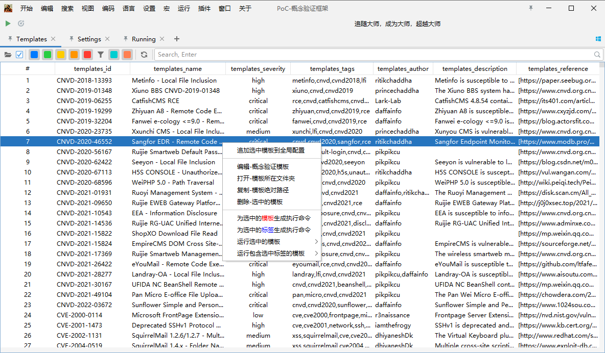
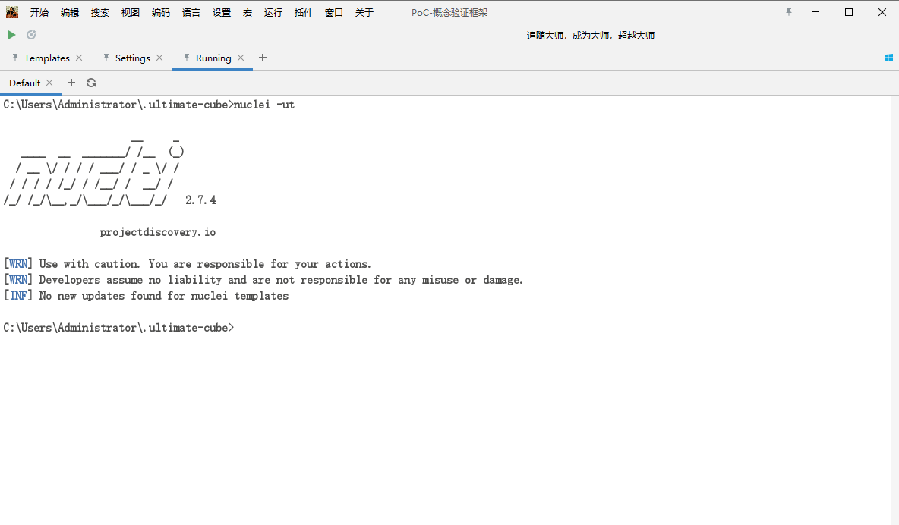

[//]: # (![nuclei-plus-icon]&#40;doc/images/icon.png&#41;)

<div align=center style="margin-top: 10px;">

[comment]: <> (    )

<h1>nuclei-plus</h1>
</div>

#### 简介

Nuclei 用于基于模板跨目标发送请求，从而实现零误报并提供对大量主机的快速扫描。
Nuclei 提供对各种协议的扫描，包括 TCP、DNS、HTTP、SSL、File、Whois、Websocket、Headless 等。凭借强大而灵活的模板，Nuclei 可用于对各种安全检查进行建模。

#### 计划
- [x] 支持系统托盘
- [x] 支持输出自定义配置
- [x] 支持代理配置
- [x] 支持全局参数执行操作
- [x] 支持全局 `PoC` 配置
- [x] 修改工作空间  
- [ ] 支持 `interactsh` 配置进行带外数据探测
- [ ] 支持项目管理，参考 `burpsuite`

#### 编译
```shell
mvn clean package -DskipTests
```

#### 截图

##### PoC模板管理



##### Fofa获取目标


##### 运行终端


