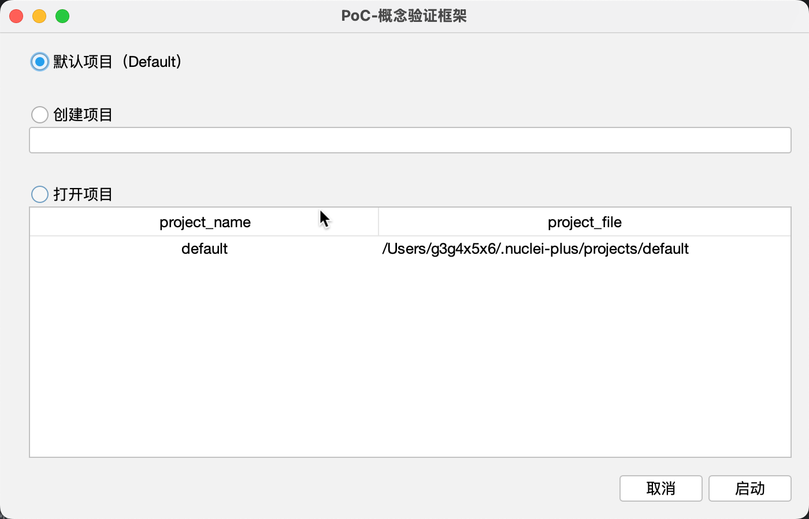
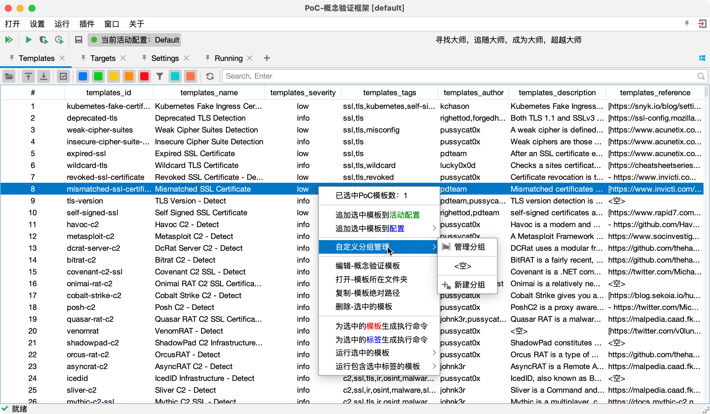

<div align=center style="margin-top: 10px;">


<h1>nuclei-plus</h1>
</div>

#### 简介

Nuclei 用于基于模板跨目标发送请求，从而实现零误报并提供对大量主机的快速扫描。
Nuclei 提供对各种协议的扫描，包括 TCP、DNS、HTTP、SSL、File、Whois、Websocket、Headless 等。凭借强大而灵活的模板，Nuclei
可用于对各种安全检查进行建模。

#### 计划

- [x] 支持系统托盘
- [x] 支持项目管理
- [x] 支持配置管理
- [x] 支持模板管理
- [x] 支持模板编辑
- [x] 支持国际化，默认 `zh`
- [x] 支持多种网络空间引擎接口搜索

#### 编译

```shell
# JDK11+

# add terminal
mvn install:install-file -Dfile=libs/jediterm-core-3.44-SNAPSHOT.jar -DgroupId=com.jediterm  -DartifactId=jediterm-core -Dversion=3.44-SNAPSHOT -Dpackaging=jar
mvn install:install-file -Dfile=libs/jediterm-ui-3.44-SNAPSHOT.jar -DgroupId=com.jediterm  -DartifactId=jediterm-ui -Dversion=3.44-SNAPSHOT -Dpackaging=jar

# set a new version
mvn versions:set -DnewVersion=7.5.11

# package
mvn clean package -DskipTests -Dproject.build.sourceEncoding=UTF-8
```

#### 运行

```shell
# JDK11+
java -jar nuclei-x.x.x.jar
```

#### 使用

[操作文档](https://yong-an-dang.github.io/nuclei-plus/)


**项目启动**



**操作界面**


